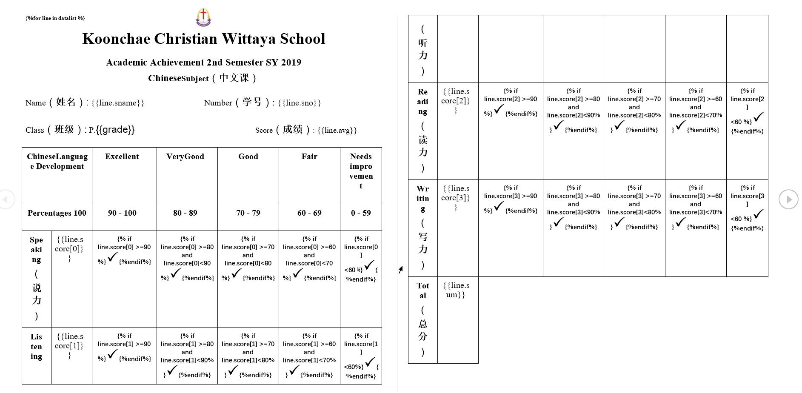

### 依赖库

- docxtpl
- win32com

### 处理tmp下的文本数据

- 计算总分、个人平均分、班级平均分
- 对班级成绩按照总分进行排序
- 导出数据到WOrd并生成PDF
- 统计班级成绩到csv表格文件
- 数据样例
```shell
1	Mintaya     	 Kanjana	12	11	39	15
2	Achiraya       	Sirinapasup	14	15	40	25
3	Pimpisa       	Rungmaneekan	15	15	44	25
4	Kananut       	Jeenanong	11	10	35	15
5	Nutnicha        	Muangjai	15	14	43	23
6	Pannakon       	Sutapong	10	11	29	13

```

#### word模板样例



#### word渲染结果图


### sorted及sort区别

- sorted会产生新的列表
- sort在原始列表上进行排序，不会产生新的列表

```python
# 使用自定义的值作为排序key
lines=sorted(lines1,key=lambda s:s["avg"],reverse=True)
```

###写入csv中文乱码的解决方案

```python
fw.write(fname+",,总分平均分:,".decode("utf-8").encode("gbk")+str(savg)+",,平均分:,".decode("utf-8").encode("gbk")+str(int(savg/4.0))+",\n\n")
```


